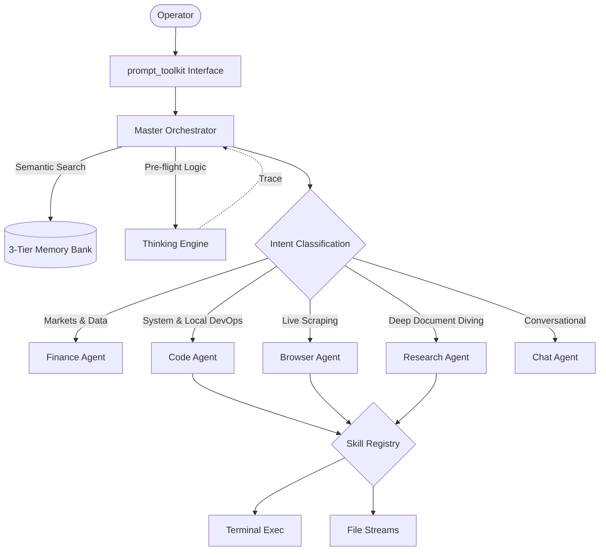

# 📘 Lirox Handbook (v2.0)
### Master-Orchestrated Autonomous OS 

Lirox is a production-grade autonomous agent system designed for terminal-first research, coding, financial analysis, and system automation.

---

## 🏛️ System Architecture & Connectivity
Lirox v2 operates on a **Hierarchical Routing** model.

---

## 🚀 Core Sub-Agent Workflows

### 1. The Code Agent
Lirox acts as a Senior Software Engineer via the Code Agent.
- **Workflow**: `Query` → Project Code Scan (looks for Python/JS config files) → Extraction → Chain of thought → Execute terminal commands/File Writes to fix errors or generate files automatically.
- **Safety**: Uses a built shell-argument parser inside `lirox.tools.terminal.run_command` that strips out malicious injections.

### 2. The Finance Agent
Institutional research module routing queries dynamically.
- **Workflow**: Classifies intent → Fetches data via Yahoo Finance endpoint (`market_data`, `fundamentals`) → Compiles an analytical response bridging macro variables with fundamental stock metrics.

### 3. The Research & Browser Agents
Deep parallel execution engines.
- **Browser**: Employs Python headless requests and Beautiful Soup to load exact webpages.
- **Research**: Uses API toolkits (like DDG/Tavily) to synthesize multiple parallel links into comprehensive readouts.

---

## 🛠️ Security Protocol: The "Hardened Shell"

For local interaction, `CodeAgent` invokes the **Safe Terminal Tool**:
1. **Allowlist Mapping**: Blocked against self-referential or destructive commands.
2. **Subprocess Isolation**: All pipelines utilize raw string array mapping `shlex.split(cmd)`, totally disabling `shell=True` bash injection liabilities.
3. **Regex Injection Detection**: Blocks command substitution (`$( )`, `` ` ``) inherently protecting the host OS.

---

## 🧠 The Thinking Engine
v2.0 abstracts intelligence planning into a unique object called the **Thinking Engine**. Before any physical execution or web search occurs, this Engine spins up a `<thinking>` loop evaluating goals, constraints, constraints logic, and generating an iterative plan, assuring fewer hallucinations and significantly higher success ratios on complex, multi-stage prompts.

---
*Lirox: Intelligence as an Operation System.*
