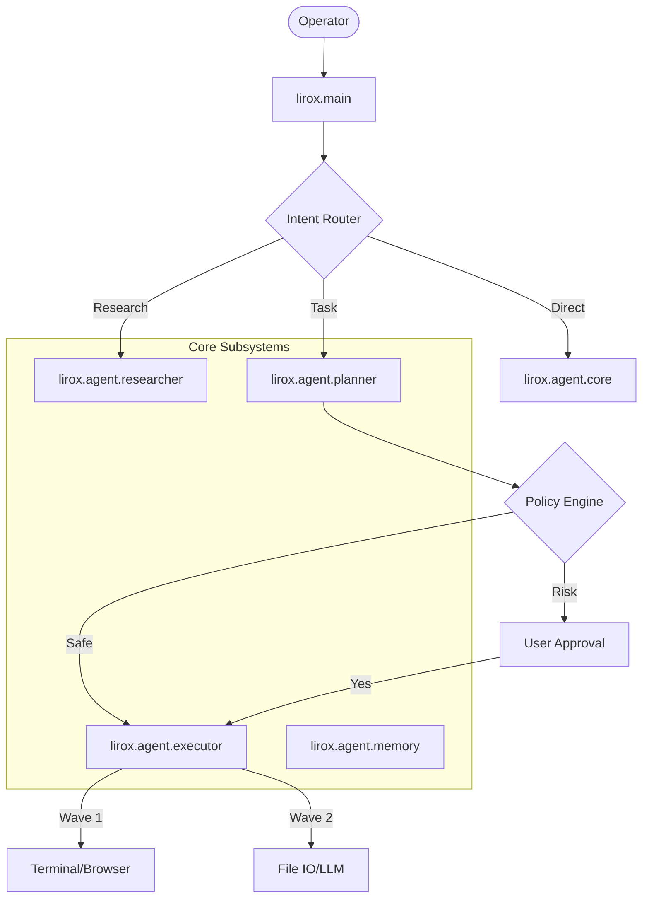

# 📘 Lirox Handbook (v0.6)
### Professional Autonomous CLI Assistant OS

Lirox is a production-grade autonomous agent system designed for terminal-first research, coding, and system automation.

---

## 🏛️ System Architecture & Connectivity
Lirox operates on a **Wave-Based Execution** model.

---

## 🚀 Professional Workflows

### 1. Deep Research (Tiered)
Lirox uses a multi-source parallel search engine with automated source verification.
- **Workflow**: `/research "query"` → Decomposition → Parallel Search (Tavily/Serper/DDG) → Content Extraction → Report Generation.
- **Tiers**:
    - **Free**: DuckDuckGo (Standard depth).
    - **Pro**: Tavily/Serper (Deep depth, 12+ sources).

### 2. Autonomous Task Execution
Lirox breaks complex goals into atomic, dependency-aware steps.
- **Workflow**: `/think "goal"` → Logic Trace → Strategic Plan → Risk Evaluation → Wave-Based Execution → Summary Reflection.

### 3. Identity & Profile Management
The agent adapts its persona based on the Operator's niche.
- **Command**: `/profile`
- **Logic**: Persona is injected into every system prompt as a core instruction set.

---

## 🛠️ Tool Connectivity Chart

| Tool | Subsystem | Domain Access | Safety Level |
| :--- | :--- | :--- | :--- |
| **Terminal** | `lirox.tools.terminal` | Local System Shell | 🔴 High (Blocked) |
| **Browser** | `lirox.tools.browser` | Global Web | 🟢 Low (Read-only) |
| **File I/O** | `lirox.tools.file_io` | `/outputs`, `/data` | 🟡 Medium (Restricted) |
| **Memory** | `lirox.agent.memory` | `memory.json` | 🟢 Low (Internal) |

---

## 🛡️ Security Protocol: The "Hardened Shell"
v0.6 introduces the **Recursive Pipeline Validator**:
1. **Allowlist Mapping**: Only 60+ pre-approved developer tools are accessible.
2. **Chain Verification**: Every command in a pipeline (`|`, `&&`, `;`, `||`) is parsed and validated individually.
3. **Regex Injection Detection**: Blocks command substitution and exfiltration patterns (`$( )`, `` ` ``).

---

## 🌍 Connecting External APIs
Run `/add-api` to connect your LLM providers or `/add-search-api` for research power.
- **Supported LLMs**: Gemini, Groq, OpenAI, Anthropic, OpenRouter, DeepSeek, Nvidia.
- **Supported Search**: Tavily, Serper, Exa.

---
*Lirox: The Autonomous Kernel.*
