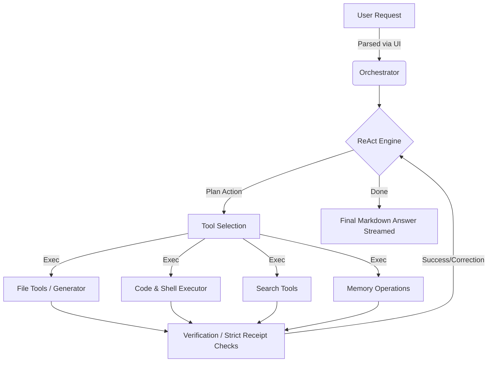
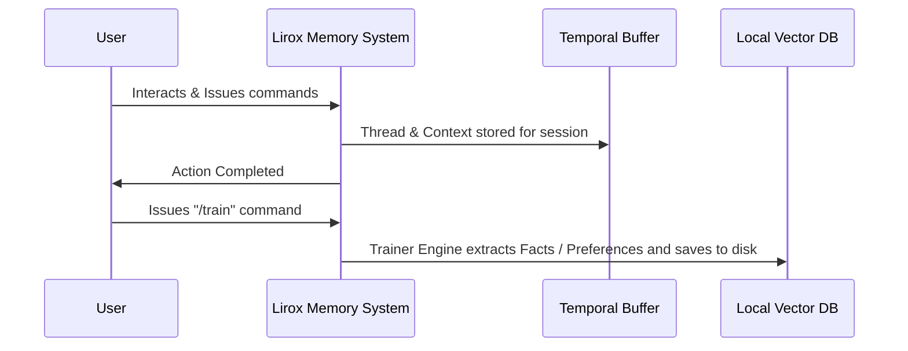

<div align="center">

# 🦁 Lirox: Intelligence as an Operating System

**A terminal-first, local-first autonomous AI agent that reads, writes, and controls your desktop.** 
Lirox learns who you are, remembers your conversations, and constantly evolves.

[](#)
[](https://www.python.org/downloads/)
[](#)

</div>

<br/>

Lirox is not just a chatbot; it's an **intelligent reasoning engine** running natively on your machine space. It integrates deeply into your operating system to safely execute shell commands, autonomously generate complex file structures, surf the web, and store long-term learnings spanning across multiple sessions securely on disk.

---

## 📑 Table of Contents

- [Requirements](#requirements)
- [What Lirox Can Do & Core Features](#what-lirox-can-do--core-features)
- [How Lirox Thinks (Flowcharts)](#how-lirox-thinks-flowcharts)
- [Commands](#commands)
- [Quick Install](#quick-install)
- [Platform-Specific Installation](#platform-specific-installation)
  - [Windows](#windows)
  - [Linux](#linux)
  - [macOS](#macos)
- [Virtual Environment Setup (Recommended)](#virtual-environment-setup-recommended)
- [First Run & Setup](#first-run--setup)
- [API Keys](#api-keys)
- [Troubleshooting](#troubleshooting)
- [Architecture](#architecture)
- [License](#license)

---

## 📋 Requirements

- **Python 3.9 or newer** — [python.org/downloads](https://www.python.org/downloads/)
- **pip** (comes with Python; if missing run `python -m ensurepip --upgrade`)
- **Git** (optional, for cloning) — [git-scm.com](https://git-scm.com)
- At least one LLM API key — see [API Keys](#api-keys)

All Python library dependencies are installed automatically. If any library is missing when Lirox starts, it will detect and install it for you. You can also install them manually:

```bash
pip install -r requirements.txt
```

---

## 🌟 What Lirox Can Do & Core Features

- **🧠 Autonomous ReAct Engine:** Lirox features a strict "Plan-Execute-Verify" pipeline ensuring every action is deliberately planned and evaluated before moving forward.
- **📄 Native File & Document Engine:** Generates rich project architectures, codebases, PDFs, Word docs (DOCX), Excel spreadsheets (XLSX), and PowerPoint presentations natively out-of-the-box verified on disk.
- **💻 Verified System Control:** Runs shell commands safely with an allowlist protection and verification buffer.
- **🌐 Web Search:** Live knowledge via DuckDuckGo and other search operators.
- **💭 Living Episodic Memory:** Automatically runs background categorization threads (`/train`) extracting critical facts, code preferences, and ongoing projects into long-term memory.
- **🔄 Universal Memory Import:** Setup Wizard automatically provisions imports directly from ChatGPT, Claude, and Gemini exports.
- **🛠 Code Knowledge:** Knows its own code—ask it about its architecture.
- **🧩 Auto-installs missing dependencies:** Lirox detects and installs any missing Python libraries on startup.

---

## 🛠 How Lirox Thinks (Flowcharts)

### ReAct Engine Execution Pipeline



### Episodic Memory & Local Learning Flow



---

## ⚡ Commands

Lirox provides a suite of deeply integrated commands to control the engine directly from the CLI.

| Command | Usage / Parameters | Description |
|:---|:---|:---|
| `/help` | - | Show all system commands and syntax. |
| `/setup` | - | Launch the interactive console setup wizard. |
| `/session` | - | Display current working session information. |
| `/history` | `[n]` | Query historical session logs (default: last 20). |
| `/memory` | - | Analyze memory, buffers, and active memory retention stats. |
| `/profile` | - | Show User & Agent profile configurations. |
| `/train` | - | Extract facts, projects, and preferences from sessions to permanent vault. |
| `/recall` | - | List deeply cached user knowledge and project states. |
| `/workspace`| `[path]` | Show or change the core execution workspace directory path. |
| `/models`| - | List configurations and availability strings for provider backends. |
| `/use-model`| `<model_name>` | Select and pin an LLM backend (e.g. `groq`, `gemini`). Use `auto` to reset. |
| `/test`| - | Run dependency diagnostics, file system checks, and internal checks. | 
| `/reset`| - | Flush session memory and restart context explicitly. |
| `/backup`| - | Encrypt and ZIP profile/memory assets, saving backup to local disk. |
| `/import-memory`| `<path>` | Ingest existing conversational histories from JSON exports. |
| `/export-memory`| - | Extract active knowledge and settings into an external raw JSON file. |
| `/update`| - | Verify upstream changes and sync via git/pip immediately. |
| `/restart`| - | Safely reboot Lirox kernel processes without breaking active bash. |
| `/uninstall`| - | Purge all data folders, caches, DBs and environments entirely. |
| `/exit`| - | Shutdown operations and exit. |

---

## 🚀 Quick Install

```bash
# 1. Clone the repository
git clone https://github.com/baljotchohan/Lirox.git
cd Lirox

# 2. Install Lirox
pip install -e .

# 3. Run Lirox
lirox
```

> **Note:** If `pip install -e .` gives the error  
> `ERROR: file:///C:/Users/... does not appear to be a Python project`  
> make sure you are **inside the Lirox folder** before running the command (the folder must contain `pyproject.toml`).

---

## 📦 Platform-Specific Installation

### Windows

**Option A — Automated installer (recommended)**
```bat
git clone https://github.com/baljotchohan/Lirox.git
cd Lirox
install_windows.bat
```

**Option B — Manual steps**
```bat
:: 1. Verify Python is installed
python --version
:: If not found, try:
py --version

:: 2. Upgrade pip
python -m pip install --upgrade pip

:: 3. Install Lirox
python -m pip install -e .

:: 4. Run Lirox
lirox
```

**Option C — If `lirox` command is not found after install**
```bat
:: Run via Python module directly
python -m lirox

:: Or add Python's Scripts folder to PATH, e.g.:
:: C:\Users\YourName\AppData\Local\Programs\Python\Python3xx\Scripts
```

---

### Linux

**Option A — Automated installer (recommended)**
```bash
git clone https://github.com/baljotchohan/Lirox.git
cd Lirox
chmod +x install_linux.sh
./install_linux.sh
```

**Option B — Manual steps**
```bash
# 1. Install Python & pip (if not already installed)
# Ubuntu/Debian:
sudo apt update && sudo apt install -y python3 python3-pip

# Fedora/RHEL:
sudo dnf install -y python3 python3-pip

# Arch Linux:
sudo pacman -S python python-pip

# 2. Upgrade pip
python3 -m pip install --upgrade pip

# 3. Clone and install
git clone https://github.com/baljotchohan/Lirox.git
cd Lirox
python3 -m pip install -e .

# 4. Run Lirox
lirox
```

**Option C — If `lirox` command is not found**
```bash
# Add ~/.local/bin to PATH
echo 'export PATH="$HOME/.local/bin:$PATH"' >> ~/.bashrc
source ~/.bashrc

# Or run directly
python3 -m lirox
```

---

### macOS

**Option A — Automated installer (recommended)**
```bash
git clone https://github.com/baljotchohan/Lirox.git
cd Lirox
chmod +x install_macOS.sh
./install_macOS.sh
```

**Option B — Manual steps**
```bash
# 1. Install Python (via Homebrew is recommended)
brew install python

# 2. Upgrade pip
python3 -m pip install --upgrade pip

# 3. Clone and install
git clone https://github.com/baljotchohan/Lirox.git
cd Lirox
python3 -m pip install -e .

# 4. Run Lirox
lirox
```

**Option C — macOS system Python restrictions (externally-managed-environment error)**
```bash
# Use a virtual environment (recommended):
python3 -m venv lirox-env
source lirox-env/bin/activate
pip install -e .
lirox

# Or allow system pip override (use with caution):
pip install --break-system-packages -e .
```

**Option D — If `lirox` command is not found**
```bash
# Add Python bin to PATH — detect your version first, then update PATH
python3 --version          # e.g. "Python 3.11.9" → version is 3.11
echo 'export PATH="$HOME/Library/Python/3.11/bin:$PATH"' >> ~/.zshrc   # replace 3.11 with your version
source ~/.zshrc

# Or run directly without changing PATH
python3 -m lirox
```

---

## 🛡 Virtual Environment Setup (Recommended)

Using a virtual environment keeps Lirox isolated from your system Python and avoids permission issues:

```bash
# Create virtual environment
python3 -m venv lirox-env        # Linux/macOS
python  -m venv lirox-env        # Windows

# Activate it
source lirox-env/bin/activate    # Linux/macOS
lirox-env\Scripts\activate       # Windows (cmd)
lirox-env\Scripts\Activate.ps1   # Windows (PowerShell)

# Install inside the environment
pip install -e .

# Run Lirox
lirox

# Deactivate when done
deactivate
```

---

## 🏁 First Run & Setup

Booting up for the very first time:

```bash
# Start Lirox
lirox

# Run the setup wizard (add API keys, set your profile)
lirox --setup

# Check version runtime
lirox --version
```

---

## 🔑 API Keys

Lirox supports multiple LLM providers. Add at least one during `lirox --setup`:

| Provider | Cost | Link |
|----------|------|------|
| **Groq** | Free limits | [console.groq.com](https://console.groq.com) |
| **Gemini** | Free limits | [aistudio.google.com](https://aistudio.google.com) |
| **OpenRouter** | Free tier | [openrouter.ai](https://openrouter.ai) |
| **Ollama** | Local / Free | [ollama.com](https://ollama.com) |
| **OpenAI** | Paid | [platform.openai.com](https://platform.openai.com) |
| **Anthropic** | Paid | [console.anthropic.com](https://console.anthropic.com) |

---

## 🏥 Troubleshooting

### `ERROR: file:///C:/Users/... does not appear to be a Python project`

This error means pip cannot find `pyproject.toml` or `setup.py`. **Solution:** run `pip install -e .` from inside the cloned Lirox directory:

```bash
cd Lirox       # make sure you are in the project root
pip install -e .
```

### `lirox: command not found` (Linux/macOS)

Python user scripts may not be on your `PATH`. Fix:

```bash
# Linux
echo 'export PATH="$HOME/.local/bin:$PATH"' >> ~/.bashrc && source ~/.bashrc

# macOS (zsh) — detect your Python version first:
#   python3 --version   →  e.g. "Python 3.11.9"  →  use 3.11 below
echo 'export PATH="$HOME/Library/Python/3.11/bin:$PATH"' >> ~/.zshrc && source ~/.zshrc

# Or use the module form:
python3 -m lirox
```

### `lirox` not recognized (Windows)

Python's `Scripts` directory is not on your `PATH`. Either:

1. Reinstall Python and check **"Add Python to PATH"** during setup.
2. Manually add the Scripts folder to your system PATH. Find the exact path by running `python -c "import sys; print(sys.executable)"` — the `Scripts` folder is in the same directory (e.g. `C:\Users\YourName\AppData\Local\Programs\Python\Python311\Scripts`).
3. Use the module form: `python -m lirox`

### `externally-managed-environment` error (macOS/Linux)

Your system Python is protected. Use a virtual environment or add the flag:

```bash
# Recommended: virtual environment
python3 -m venv lirox-env && source lirox-env/bin/activate && pip install -e .

# Quick override (not recommended for system Python)
pip install --break-system-packages -e .
```

### Missing dependency at runtime

Lirox will auto-detect and install missing packages when it starts. If that fails, install manually:

```bash
pip install -r requirements.txt
```

### `pip` not found

```bash
# Linux
sudo apt install python3-pip    # Ubuntu/Debian
sudo dnf install python3-pip    # Fedora

# macOS
brew install python

# All platforms
python3 -m ensurepip --upgrade
python3 -m pip install --upgrade pip
```

---

## 🏗 Architecture

```text
lirox/
├── main.py               # Lirox Process Shell & Command Handlers
├── config.py             # System Configurations
├── agent/ 
│   ├── profile.py        # System identity and core profile bindings
├── agents/ 
│   ├── base_agent.py     # Base abstract behavior nodes 
│   └── personal_agent.py # The dynamic identity mapping layer
├── mind/
│   ├── learnings.py      # Permanent Key-Value vector DB handler
│   ├── soul.py           # Identity parameterization algorithms
│   └── trainer.py        # Entity extractions from /train mapping
├── orchestrator/
│   └── master.py         # Sub-process threading & Master Controller
├── memory/               
│   ├── manager.py        # 3-tier memory abstraction logic (buffer + logs + long term)
│   └── session_store.py  # SQLite cache persistence models
├── tools/                # Sub-system tool injections
│   ├── file_tools.py     # Sandbox aware disk mutation
│   ├── file_generator.py # Robust PDF/Word/Spreadsheet generator module 
│   ├── terminal.py       # Safe shell execution controller
│   ├── shell_verified.py # Verified executor
│   └── code_executor.py  # Sandboxed python execution contexts
├── ui/                   # Rich Terminal System Interactions
│   ├── display.py        # Block, Chunk, Streaming UI Logic
│   └── wizard.py         # Set up Wizard
└── verify/
    ├── receipt.py        # Structured transaction hash mappings
    └── disk.py           # Hard drive block presence checks
```

---

## ⚖️ License

MIT License. See `LICENSE` for more information.
