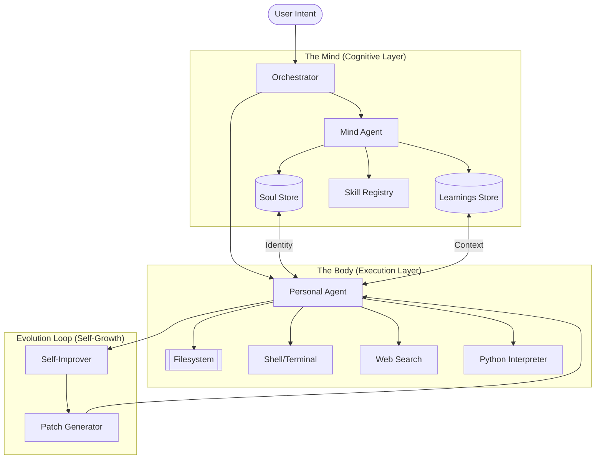
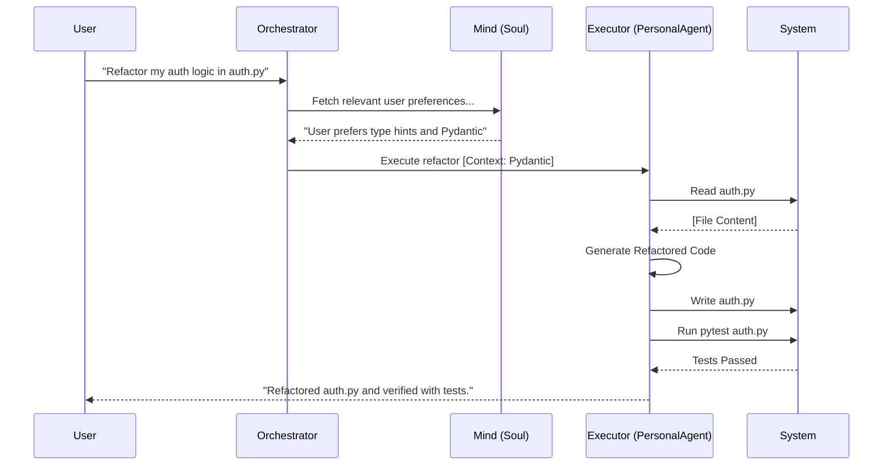

<div align="center">

```text

```

# 🦁 LIROX: THE AUTONOMOUS AGENTIC OS

**"Intelligence as an Operating System — Terminal-first. Local-first. Persistent."**

[](LICENSE)
[](https://python.org)
[](#local-first)
[](#self-improvement-engine)

---

### ✦ The Vision
Lirox is not just another LLM wrapper. It is a **Personal AI Agent Operating System** that lives in your terminal. While generic AI tools forget you the second you close the tab, Lirox builds a **recursive memory model** of your professional identity, projects, and working style. 

It doesn't just "chat"—it **executes**. It reads your codebase, manages your filesystem, automates your shell, and researches for you, all while evolving into a digital mirror of your own expertise.

</div>

---

## 📐 System Architecture

Lirox is built on a tripartite architecture that separates high-level cognitive planning from low-level system execution.



---

## 💎 Core Components

### 🧠 The Soul (Mind Agent)
Unlike standard chat buffers, Lirox features a **Mind Agent** that continuously extracts facts, preferences, and project contexts. 
- **Recursive Learning:** Silently analyzes interactions to update your "Soul" file.
- **Knowledge Crystallization:** Use `/train` to synthesize messy sessions into permanent architectural knowledge.
- **Zero-Latency Recall:** Automatically injects relevant past facts into new queries without you asking.

### 💻 The Executor (Personal Agent)
The PersonalAgent handles the "heavy lifting" with **zero truncation** and **full system access**.
- **System CRUD:** Create, read, patch, and delete files with natural language.
- **Autonomous Terminal:** Run commands, manage git repos, and install dependencies.
- **Verified Synthesis:** Writes and **immediately executes** code in a sandbox to verify correctness before delivering it to you.

### 🛠 The Skill Engine
Extend Lirox by simply describing what you need.
- **Natural Language Extension:** Describe a workflow (e.g., "Monitor this log file and alert me on errors") and Lirox generates the Python logic.
- **Reusable Tooling:** Skills are saved as permanent Python modules that any agent can call.

---

## 🎮 Command Suite

Lirox provides a high-density CLI for power users.

### 🔍 Query & Reasoning
| Command | Action | Deep Dive |
| :--- | :--- | :--- |
| `/think <q>` | **Deep Reason** | Activates an 8-phase reasoning engine for complex architecture. |
| `/task <str>` | **Multi-Step** | Plans, asks for permission, and executes complex file/shell sequences. |
| `/learnings` | **Memory View** | Peek inside Lirox's mental model of your expertise. |

### 🤖 Agent & Skill Management
| Command | Action | Description |
| :--- | :--- | :--- |
| `/add-agent` | **Summon** | Create a specialized sub-agent (e.g., `@Architect`, `@Reviewer`). |
| `/add-skill` | **Teach** | Convert a natural language description into a reusable tool. |
| `/agents` | **Roster** | List all built-in and custom cognitive entities. |
| `@<agent>` | **Dispatch** | Route a specific query to a specialized personality. |

### 🔋 System & Memory
| Command | Action | Description |
| :--- | :--- | :--- |
| `/train` | **Crystallize** | Force a summary of recent sessions into the permanent Soul. |
| `/soul` | **Identity** | View the current personality metrics and learned identity. |
| `/improve` | **Self-Audit** | Trigger the self-improvement loop for the Lirox codebase. |
| `/setup` | **Configure** | Interactive wizard for API providers (Gemini, Claude, Ollama). |

---

## 🛠 Self-Improvement Workflow

Lirox is designed to maintain and fix itself. This recursive loop ensures the OS stays performant and bug-free.

1.  **Auditing**: `/improve` scans the `lirox/` directory for circular imports, dead code, or inefficient patterns.
2.  **Staging**: Lirox generates unified diffs (patches) to fix identified issues.
3.  **Applying**: Use `/apply` to approve. Lirox creates a backup, applies the fix, and hot-swaps the code via `/restart`.

---

## 🚀 How It Works: The Execution Loop



---

## ⚡ Installation

### 1. Requirements
- Python 3.9+
- Optional: [Ollama](https://ollama.com) for 100% local execution.

### 2. Quick Start
```bash
# Clone the repository
git clone https://github.com/baljotchohan/lirox.git
cd lirox

# Install with all dependencies
pip install -e ".[full]"

# Initialize your providers
lirox --setup

# Launch the OS
lirox
```

### 3. Local-First Configuration
To run 100% locally with Ollama, update your `.env`:
```env
LOCAL_LLM_ENABLED=true
OLLAMA_MODEL=llama3.1
```

---

## 📂 Project Structure

```text
lirox/
├── agents/          # Cognitive entities (PersonalAgent, MindAgent)
├── autonomy/        # Self-improvement & recursive loop logic
├── memory/          # Soul, Learnings, and Session persistence
├── mind/            # Personality engine and soul management
├── skills/          # Dynamic natural language tools
├── thinking/        # Chain-of-thought and reasoning engines
└── tools/           # Low-level system interfaces (file, shell, web)
```

---

<div align="center">
  <p><strong>Terminal-first. Local-first. Persistent.</strong></p>
  <p><em>Built with ❤️ for the developers of tomorrow.</em></p>
</div>
