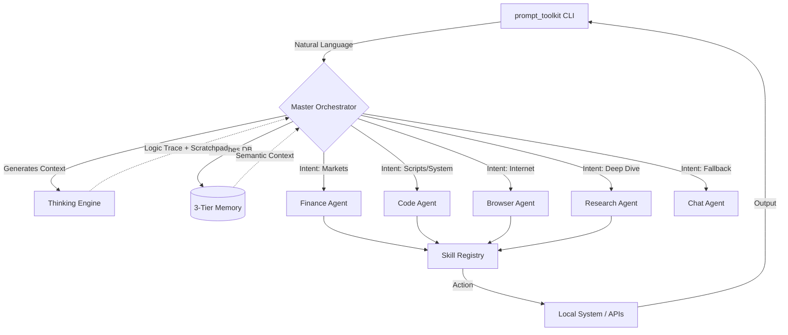

<div align="center">
  <pre>
  ██╗     ██╗██████╗  ██████╗ ██╗  ██╗
  ██║     ██║██╔══██╗██╔═══██╗╚██╗██╔╝
  ██║     ██║██████╔╝██║   ██║ ╚███╔╝ 
  ██║     ██║██╔══██╗██║   ██║ ██╔██╗ 
  ███████╗██║██║  ██║╚██████╔╝██╔╝ ██╗
  ╚══════╝╚═╝╚═╝  ╚═╝ ╚═════╝ ╚═╝  ╚═╝
  </pre>
  <h1>Lirox Autonomous OS</h1>
  <p><strong>v2.0 — Hierarchical Multi-Agent Architecture</strong></p>
</div>

Lirox is a powerful, terminal-first autonomous AI agent acting as an operating system layer directly over your bash terminal. Powered by an advanced cognitive architecture, Lirox captures conversational intent, constructs deep reasoning traces, and delegates tasks to specialized sub-agents armed with physical system tools.

---

## 🌟 Key Features (v2.0)

- **Hierarchical Multi-Agent System**: Queries are classified by a Master Orchestrator and routed to specialized expert agents (Finance, Code, Browser, Research, Chat).
- **Thinking Engine (Chain-of-Thought)**: Behind every query, a dedicated logic engine runs silent deep reasoning and structural planning (visualized by a sleek, dynamic reasoning spinner) before returning actionable results.
- **Pluggable Skill Architecture**: Completely decoupled tool execution. Skills self-register and declare their intent and risk profiles. Sub-agents wield these skills to safely manipulate local files and commands.
- **Risk & Permission Guardrails**: Explicit clearance limits. High-risk skills (like `bash` execution or file manipulations) are strictly bounded to prevent catastrophic host machine alterations.
- **3-Tier Memory System**: Retains short-term contextual buffers, extracts long-term semantic facts bridging sessions, and aggregates them into contextual synthesis.

---

## ⚙️ How It Works (The v2 Architecture)

The system revolves around the **Master Orchestrator**, which intercepts queries, activates the **Thinking Engine**, and pipes the logic context to the most appropriate Sub-Agent.



---

## 🛠️ The Sub-Agents (The "Hive")

Lirox v2 implements 5 distinctive Sub-Agents out of the box:

| Agent | Purpose | Tools Wielded |
|---|---|---|
| **Code Agent** | Software engineering, generating algorithms, debugging. | Modifies local files, executes secure Bash/Terminal scripts. |
| **Finance Agent** | Institutional-grade equity, macroeconomic research. | Invokes Yahoo Finance APIs, market screeners, fundamental datasets. |
| **Browser Agent** | Internet interactions & live data scraping. | Uses HTTP requests / headless web parsers to surf public domains. |
| **Research Agent** | Multi-source academic and topic synthesis. | Leverages DuckDuckGo, Tavily, and text extraction logic. |
| **Chat Agent** | Native handler for conversational flow & chitchat. | General intelligence algorithms. |

---

## 🚀 Installation & Setup

1. **Clone the Repository**
   ```bash
   git clone https://github.com/your-username/Lirox.git
   cd Lirox
   ```

2. **Install Dependencies**
   ```bash
   pip install -r requirements.txt
   ```
   *(Ensure you have `rich`, `prompt_toolkit`, `psutil`, `bs4`, `python-dotenv` installed)*.

3. **Initialize the Agent**
   To instantly jump into the internal Lirox CLI and initial setup wizard:
   ```bash
   python lirox/main.py
   # OR if entrypoints built:
   lirox
   ```

---

## 💻 Usage & Commands

Once inside the active session, communicate naturally. Lirox will automatically sense whether you need to write software or check the stock market:

```bash
# Natural Language Execution
[Lirox] ✦ Research the 2026 impact of solid state batteries and create a markdown report on my Desktop.
[Lirox] ✦ Look up TSLA earnings and perform a valuation.
[Lirox] ✦ Fix the python syntax errors in my src/main.py file.
```

**System Directives:**
- `/help` - Show all commands.
- `/agents` - View active sub-agents and domains.
- `/models` - Show active LLM providers.
- `/memory` - Peek into the 3-Tier memory bank system.
- `/think <query>` - Run just the chain-of-thought logic.
- `/profile` - View your agent's learning context and your personalization config.
- `/test` - Run system diagnostic tests.
- `/reset` - Factory wipe session memory.

---

<div align="center">
  <i>Developed to bring structured agent logic safely to standard terminals globally.</i>
</div>
