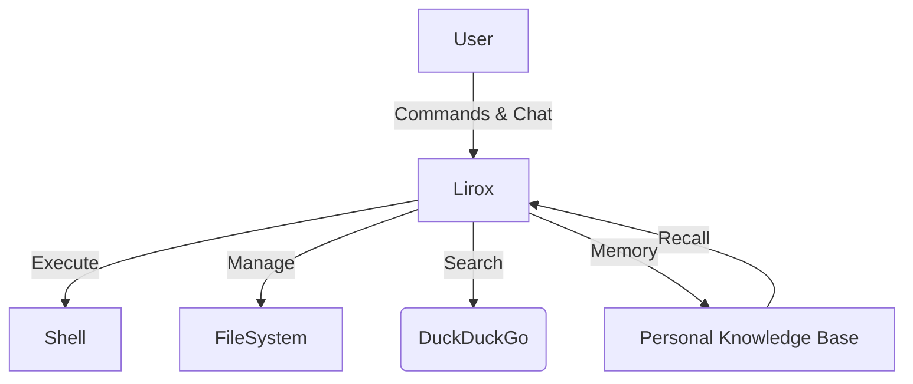

<div align="center">

# 🦁 Lirox

**Intelligence as an Operating System**

[](https://github.com/baljotchohan/Lirox)
[](https://www.python.org/downloads/)
[](LICENSE)

*A terminal-first, local-first autonomous personal AI agent that reads, writes, and controls your desktop. Lirox learns who you are, remembers your conversations, and gets better over time.*

</div>

---

## ⚡ What is Lirox?

Lirox is a powerful, autonomous reasoning engine built locally into your terminal. It connects multi-provider LLMs directly to your file system, shell, and internet to act as a personal assistant that actively learns from you. 



---

## 🌟 Key Features

Lirox is packed with native capabilities to serve as your ultimate daily driver AI:

- 🧠 **Autonomous Reasoning Engine** – Powered by ReAct architecture, ensuring logical plan-execute-verify pipelines.
- 💾 **Living Memory & Soul** – Continuously extracts learnings from your conversations. It remembers preferences, projects, and facts using a robust `.json` driven local state backed by SQLite.
- 🗄️ **SQLite Database** – Production-grade persistence for profiles, sessions, facts, projects, usage stats, and an immutable audit trail.
- 💻 **Verified Desktop Control** – Can create, edit, move, and track files on disk securely. 
- 🐚 **Safe Shell Execution** – Runs terminal commands gracefully with built-in sandbox-style protection (allow/blocklists).
- 🌐 **Web Searching** – Pulls real-time information via DuckDuckGo seamlessly.
- 🔌 **Dynamic Multi-Provider** – Toggle effortlessly between Groq, Gemini, OpenRouter, Ollama, OpenAI, Anthropic, DeepSeek, and more.
- 🛠 **Zero-Friction Dependencies** – Boots up and auto-installs missing Python packages natively without breaking your flow.
- 🪄 **Beautiful UI** – Terminal interactions with a clean layout, streaming response rendering, word-by-word animation, and syntax highlighting.
- 📄 **Document Generation** – Create professional PDF, PPTX, DOCX, and XLSX files with genuine AI-designed content and styling.
- 🖥️ **Code Generation** – Full-stack developer mode: generate, run, fix, and test code across Python, JavaScript, TypeScript, Go, Rust, and more.
- 📚 **Self-Learning** – Extracts structured knowledge (facts, preferences, topics, projects) from every conversation and persists it across sessions.

---

## 🚀 Quick Install

```bash
# 1. Clone the repository
git clone https://github.com/baljotchohan/Lirox.git
cd Lirox

# 2. Install Lirox
pip install -e .

# 3. Start Operating
lirox
```
*(If pip gives an externally-managed-environment error, you are encouraged to use a `venv` or allow `pip install --break-system-packages -e .`)*

---

## 💻 Platform-Specific Installation

<details>
<summary><b>Windows</b></summary>

**Option A — Automated**
```bat
git clone https://github.com/baljotchohan/Lirox.git
cd Lirox
install_windows.bat
lirox
```

**Option B — Manual**
```bat
python -m pip install --upgrade pip
python -m pip install -e .
lirox
```
*(If `lirox` command not found, use `python -m lirox`)*
</details>

<details>
<summary><b>macOS</b></summary>

**Option A — Automated**
```bash
git clone https://github.com/baljotchohan/Lirox.git
cd Lirox
chmod +x install_macOS.sh
./install_macOS.sh
lirox
```

**Option B — Manual**
```bash
python3 -m pip install --upgrade pip
python3 -m pip install -e .
lirox
```
</details>

<details>
<summary><b>Linux</b></summary>

**Option A — Automated**
```bash
git clone https://github.com/baljotchohan/Lirox.git
cd Lirox
chmod +x install_linux.sh
./install_linux.sh
lirox
```

**Option B — Manual**
```bash
sudo apt update && sudo apt install -y python3 python3-pip
python3 -m pip install -e .
lirox
```
</details>

---

## ⚙️ First Run & Setup

Once installed, simply start the engine:
```bash
lirox
```

From within Lirox, you can set up your keys and profile:
```text
/setup
```

### Supported API Providers

| Provider | Cost | Link |
|----------|------|------|
| **Groq** | Free | [console.groq.com](https://console.groq.com) |
| **Gemini** | Free | [aistudio.google.com](https://aistudio.google.com) |
| **OpenRouter** | Free tier | [openrouter.ai](https://openrouter.ai) |
| **Ollama** | Local / Free | [ollama.com](https://ollama.com) |
| **OpenAI** | Paid | [platform.openai.com](https://platform.openai.com) |
| **Anthropic** | Paid | [console.anthropic.com](https://console.anthropic.com) |

---

## ⌨️ Command Reference

Lirox provides an extensive set of slash-commands to manage its operating system and your data completely.

### 🛠 System & Settings
| Command | Description |
|---------|-------------|
| `/help` | Show all available commands |
| `/setup` | Re-run setup wizard (API keys, profile) |
| `/profile` | Display your user profile |
| `/workspace [path]`| Show or change the active operational directory |
| `/models` | List all available LLM providers |
| `/use-model <n>` | Pin a specific provider (groq, gemini, ollama…) |
| `/test` | Run system diagnostics |
| `/health` | Run subsystem health checks (config, db, execution, docs, llm) |
| `/restart` | Restart the Lirox engine |
| `/update` | Auto-update repository via git pull & reinstall |
| `/exit` | Gracefully shutdown Lirox |

### 🧠 Memory & Knowledge
| Command | Description |
|---------|-------------|
| `/history [n]`| Show the last N sessions |
| `/session` | View current session routing info |
| `/memory` | Show memory buffer and long-term statistics |
| `/reset` | Wipe short-term session memory for a fresh context |
| `/train` | Force agent to extract and solidify learnings from chats |
| `/recall` | View everything Lirox has learned about you |

### 📦 Data Portability
| Command | Description |
|---------|-------------|
| `/backup` | Compress and backup all data securely |
| `/export-memory`| Export whole configuration & knowledge state to JSON |
| `/import-memory`| Import JSON context (from web ChatGPT/Claude/Lirox exports)|
| `/uninstall`| Self-destruct and wipe Lirox data safely |

---

## 💡 Use Cases

### 1. Developer Co-Pilot
> *“Lirox, create a full python script to batch download images from an API, save it to `/workspace/scripts/batch_downloader.py`, run it, and let me know if there are syntax errors.”*

### 2. Autonomous Knowledge Worker
> *“Fetch the top news on AI safety, generate a 2-page summarized report, and save it as a Markdown document on my Desktop.”*

### 3. Personal Mentor
> *(After weeks of chatting, Lirox remembers your ongoing projects)*
> *“How should I refactor the database schema in my recent web-app project?”* 

### 4. File System Cleanup
> *“Give me a list of all files in my Downloads folder larger than 100MB and calculate the total size.”*

---

## 🔧 Architecture Overview

Lirox operates logically by isolating reasoning layers from operational interfaces, ensuring sanity checks and runtime safety.

```text
lirox/
├── main.py              # Application Entry / System Ring 0
├── config.py            # Hardened Configuration Settings
├── agents/              # ReAct Reasoning Entities
├── memory/              # Buffer & Persistence Pipeline
├── mind/                # Dynamic Self / Learning Extraction
├── tools/               # Secure Sub-systems (Terminal, Search)
├── ui/                  # Rich Front-End Rendering
└── utils/               # Native Utilities & Bootstrapping
```

---

<div align="center">
  <i>Empower your workflow today securely from your terminal.</i><br>
  <b>Built by Baljot Chohan</b> under the <b>MIT License</b>.
</div>
