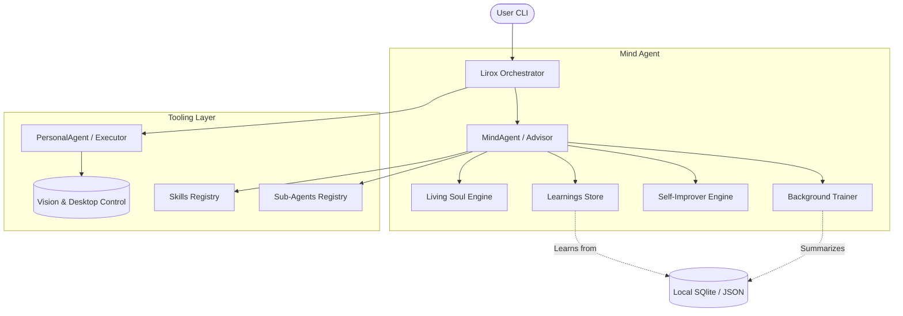

# Lirox AI OS — v0.5.0

> The terminal-native, self-growing AI Operational System.

Lirox is a massive leap forward from a generic AI wrapper. It is a persistent **Mind Agent** that lives inside your terminal. It learns about you, builds its own "Living Soul" document with every interaction, controls your desktop, uses dynamic sub-agents, and actively rewrites its own codebase to become more capable over time.

---

## 🚀 Key Features

*   🧠 **Mind Agent Architecture:** Not a stateless chatbox. Lirox retains deep, persistent memory across sessions to build a model of your nature, goals, preferences, and projects.
*   👻 **Living Soul Engine:** Your AI establishes a core persona that evolves based on how you interact. It learns your humor, directness, and patterns, forming a unique identity.
*   🔧 **Dynamic Local Skills:** You can use `/add-skill` and Lirox will write new Python tools using LLMs to permanently expand its core capabilities in real-time.
*   🤖 **Sub-Agents on Demand:** Create custom agents (e.g., `/add-agent CodeMonkey`) that Lirox can summon to execute specialized sub-tasks on your behalf.
*   💻 **Visual Desktop Control:** Real-time visual manipulation of your macOS or Linux desktop environment. It can autonomously take screenshots, analyze GUI state, read windows, and click/type.
*   🛠️ **Self-Improvement Protocol:** Run `/improve` and Lirox will audit its own source code, identify bugs, and patch itself fully autonomously.
*   🔌 **Local + Cloud LLMs:** DeepSeek, Anthropic, OpenAI, Groq, Gemini, or completely private offline Ollama integration.
*   🔄 **Memory Import:** Seamlessly ingest historical exports from ChatGPT, Claude, and Gemini to bootstrap your Lirox's knowledge baseline.

---

## 📊 System Architecture



---

## 🛠️ Usage & Commands

Lirox uses a slash-command interface directly inside its prompt loop.

### Core Mind Commands
| Command | Action |
| :--- | :--- |
| `/mind` | View the complete state of the Mind Agent (identity, knowledge, stats). |
| `/soul` | Read the AI's internal "Living Soul" state dictionary. |
| `/learnings` | View the facts, projects, and preferences Lirox currently knows about you. |
| `/train` | Manually force the Training Engine to extract data from your recent history. |
| `/improve` | **Self-Improvement:** Lirox audits its own core code and applies LLM-generated patches. |

### Capability Growth Commands
| Command | Action |
| :--- | :--- |
| `/add-skill <desc>` | Tell Lirox to develop a new capability (e.g., `/add-skill search github for repos`). |
| `/skills` | See a list of all dynamically populated skills. |
| `/add-agent <desc>` | Spawn a new, specialized sub-agent (e.g., `/add-agent a financial advisor`). |
| `/agents` | See a list of all loaded sub-agents available to the system. |

### Standard & Memory Commands
| Command | Action |
| :--- | :--- |
| `/desktop` | Checks Desktop Tool state and provides setup configuration requirements. |
| `/import-memory` | Run the wizard to inject an exported memory corpus (ChatGPT, Claude, etc). |
| `/reset` | Nuke the active session's short-term buffer buffer. |
| `/test` | Run an integration self-check loop across all Lirox services. |
| `/pause` / `/resume` | Pause or Resume Lirox operations (especially during invasive desktop actions). |

---

## ⚙️ Installation

1. Clone and install the package locally:
```bash
git clone https://github.com/baljotchohan/Lirox
cd Lirox
pip install -e .
```

2. Desktop Control Prereqs (Optional):
```bash
# General
pip install pyautogui pillow pytesseract
# macOS Screen Access
# Enable Terminal in: Settings -> Privacy & Security -> Accessibility & Screen Recording
```

3. Launch and go through the First-Run setup phase:
```bash
lirox
```

---

## 📝 The `Living Soul` Concept

The goal of Lirox v0.5 is to cross the bridge from "Assistant" to "Companion Advisor." Instead of passing a gigantic, static generic system prompt, Lirox injects a synthesized version of the `SOUL.json` file on every execution. 

If you get annoyed at Lirox, it adjusts its `curiosity` and `compliance` traits. If you praise it, it amplifies those attributes. Over time, your system diverges entirely from standard AI assistants based on the specific way you exist and build software.

---

*Lirox — Intelligence as an Operating System.*
