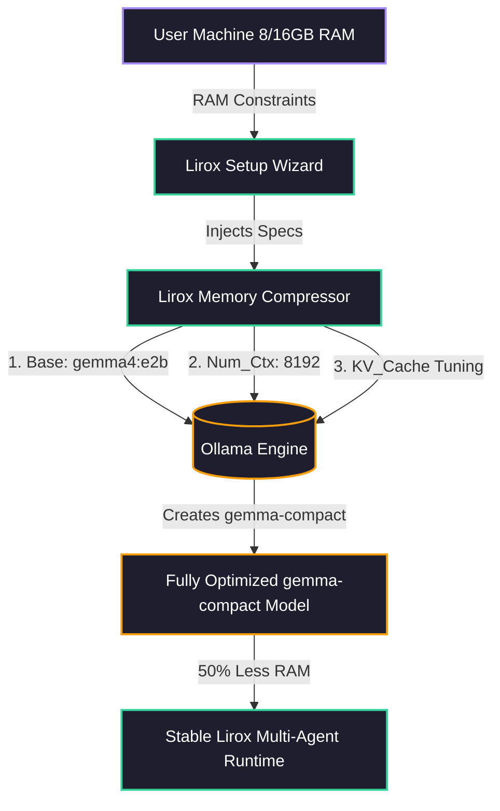
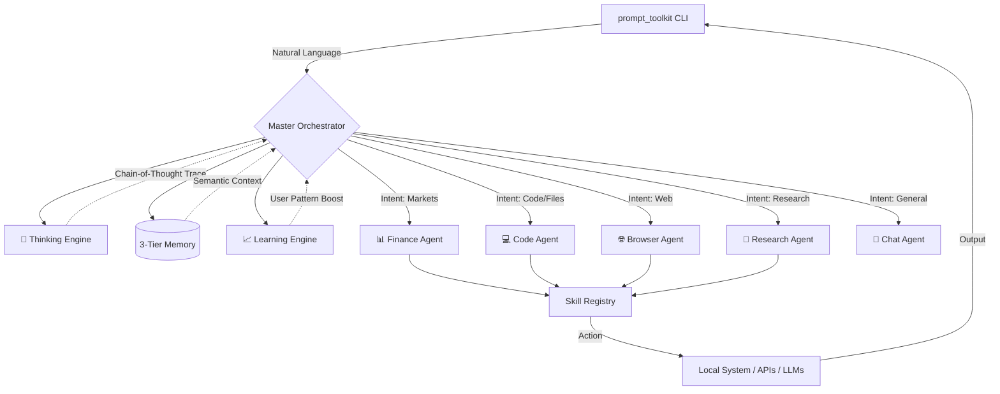

<div align="center">
  <pre>
  ██╗     ██╗██████╗  ██████╗ ██╗  ██╗
  ██║     ██║██╔══██╗██╔═══██╗╚██╗██╔╝
  ██║     ██║██████╔╝██║   ██║ ╚███╔╝ 
  ██║     ██║██╔══██╗██║   ██║ ██╔██╗ 
  ███████╗██║██║  ██║╚██████╔╝██╔╝ ██╗
  ╚══════╝╚═╝╚═╝  ╚═╝ ╚═════╝ ╚═╝  ╚═╝
  </pre>

  <h1>Lirox — Autonomous AI Agent OS</h1>
  <p><strong>Beta 1 · Terminal-First · Multi-Agent · Learns From You</strong></p>

  <p>
    
    
    
    
    
  </p>
</div>

---

> [!NOTE]
> **Identity Scope:** This project (`Lirox`) is an open-source, terminal-first autonomous AI agent OS written in Python. It is **NOT** related to the LICROX EU-funded scientific project or any robotics simulation environment.

---

## What Is Lirox?

Lirox is a **terminal-first autonomous AI agent OS** — think of it as a personal AI that lives in your terminal, remembers who you are, routes your requests to the right specialist, and actually *executes* things. Not just talks.

It's built around five specialist agents (Finance, Code, Browser, Research, Chat) orchestrated by a Master Orchestrator, powered by your choice of 7+ LLM providers — including **Ollama for fully local/private AI**.

```
You type:     "Fix the bug in my auth.py file"
Lirox:        → Thinks → Routes to Code Agent → Scans project → Generates fix → Writes file ✅
```

---

## ✨ What's New in Beta 1

| # | Feature | Impact |
|---|---------|--------|
| 1 | **Warm onboarding wizard** | Ask your name, set your agent's identity, pick goals |
| 2 | **Custom agent names** | Name your agent Lirox, Atlas, Nova, Rex, or anything you want |
| 3 | **Memory import** | Import your ChatGPT / Claude / Gemini history as day-one context |
| 4 | **Ollama integration** | Full local AI with connection test + model selection during setup |
| 5 | **Rewritten Code Agent** | File reading, web search, execution plans, safety confirmations |
| 6 | **Cross-agent helpers** | Any agent can now search the web, fetch URLs, or call free data APIs |
| 7 | **`/uninstall` command** | Clean removal of all Lirox data |
| 8 | **`/import-memory` command** | Import memory from other AI anytime, not just first run |
| 9 | **`/export-profile` command** | Dump your full profile as JSON |
| 10 | **Tech-stack learning** | Agent learns your stack (Python, React, Docker…) from conversations |
| 11 | **Smart browser fetch** | Auto-constructs URLs and fetches real data without needing APIs |
| 12 | **Emoji-rich clean output** | Strategic icons, agent-branded answers |
| 13 | **Bug fix: Code Agent scope** | `logger`/`time`/`start` are now module-level — no more `NameError` |

---

## 💾 Model Compression & Memory Optimization (gemma-compact)

Lirox Beta 1 introduces native support for **memory-optimized models**, starting with the highly efficient `gemma-compact`. By implementing an automated model compressor algorithm during setup, Lirox dramatically reduces RAM consumption while maintaining full context windows.

### How It Works

Instead of loading massive standard models, Lirox configures specialized `Modelfile` parameters (like KV cache limits and prediction scaling) specific to the user's hardware.



*The `gemma-compact` setup cuts peak RAM usage from ~15GB down to ~7.4GB, completely eliminating system stalls during intensive multi-agent code analysis.*

---

## 🏗️ Architecture

Lirox uses a **hierarchical multi-agent architecture**:



---

## 🤖 The Five Agents

| Agent | Icon | What It Does | Tools It Uses |
|-------|------|-------------|--------------|
| **Finance** | 📊 | Markets, stocks, crypto, valuations, Buffett-style analysis | Yahoo Finance, free market APIs |
| **Code** | 💻 | Write, edit, read, debug files. Run terminal commands safely | File I/O, Bash (sandboxed), web search |
| **Browser** | 🌐 | Web navigation, content extraction, smart multi-source fetch | HTTP requests, BeautifulSoup, DuckDuckGo |
| **Research** | 🔬 | Deep multi-source synthesis on any topic | DuckDuckGo, Tavily, URL scraping |
| **Chat** | 💬 | Context-aware conversation, planning, general tasks | LLM + Memory |

---

## 🧠 LLM Providers (7+)

Lirox supports a smart provider priority chain — it picks the best available one automatically:

| Provider | Key Variable | Speed | Cost | Notes |
|----------|-------------|-------|------|-------|
| **Groq** | `GROQ_API_KEY` | ⚡ Fastest | Free | Recommended |
| **Gemini** | `GEMINI_API_KEY` | Fast | Free | Google AI Studio |
| **OpenRouter** | `OPENROUTER_API_KEY` | Fast | Free/Paid | Many free models |
| **Ollama** | *(no key needed)* | Local | Free | Fully private |
| **OpenAI** | `OPENAI_API_KEY` | Fast | Paid | GPT-4o |
| **Anthropic** | `ANTHROPIC_API_KEY` | Fast | Paid | Claude |
| **DeepSeek** | `DEEPSEEK_API_KEY` | Fast | Very cheap | Great value |

> **Ollama** runs entirely on your machine. Zero data leaves your device. Set it up with `ollama serve` and any model (e.g. `gemma3`, `llama3.2`, `mistral`).

---

## 🚀 Installation

### Option A: Install from source (recommended for development)

```bash
# 1. Clone the repository
git clone https://github.com/baljotchohan/Lirox.git
cd Lirox

# 2. Install dependencies
pip install -e .

# 3. (Optional) Install all LLM provider SDKs
pip install -e ".[full]"

# 4. Run Lirox
lirox
```

### Option B: Quick start without install

```bash
git clone https://github.com/baljotchohan/Lirox.git
cd Lirox
pip install -r requirements.txt
python -m lirox
```

### Dependencies

```
rich>=13.0.0          # Terminal UI
prompt_toolkit>=3.0   # Input handling
requests>=2.31.0      # HTTP
beautifulsoup4         # Web scraping
lxml                  # HTML parser
python-dotenv         # .env management
psutil                # System info
```

---

## ⚙️ Configuration

Create a `.env` file in the project root (the setup wizard does this automatically):

```env
# Cloud LLMs (add at least one)
GROQ_API_KEY=your_key_here
GEMINI_API_KEY=your_key_here
OPENROUTER_API_KEY=your_key_here
OPENAI_API_KEY=your_key_here
ANTHROPIC_API_KEY=your_key_here
DEEPSEEK_API_KEY=your_key_here

# Local AI (Ollama)
LOCAL_LLM_ENABLED=true
OLLAMA_ENDPOINT=http://localhost:11434
OLLAMA_MODEL=gemma3

# Optional settings
MEMORY_LIMIT=100
MAX_AGENT_ITERATIONS=15
LLM_TIMEOUT=60
```

---

## 💻 Usage

### First Run — Onboarding Wizard

On first launch, Lirox runs a warm onboarding wizard:

```
👋 Hey there! Welcome to Lirox.

What should I call you? › Baljot

Nice to meet you, Baljot! 🤝

Pick an agent name:
  [1] 🦁 Lirox   [2] 🌍 Atlas   [3] ⭐ Nova   [4] 👑 Rex   [5] ✏️ Custom

What's your primary work?
  [1] Developer  [2] Founder  [3] Content Creator  [4] Researcher ...

🧠 Want to import memory from ChatGPT / Claude / Gemini? (y/N)
```

### Natural Language — Just Talk

```bash
[Lirox] ✦ fix the bug in my auth.py file
[Lirox] ✦ what is TSLA trading at today?
[Lirox] ✦ research solid state batteries and make a markdown report
[Lirox] ✦ write a FastAPI endpoint for user registration with JWT
[Lirox] ✦ fetch https://news.ycombinator.com and summarize the top stories
```

### Slash Commands

| Command | What It Does |
|---------|-------------|
| `/help` | Show all available commands |
| `/agents` | List all 5 agents and their capabilities |
| `/models` | Show configured LLM providers |
| `/memory` | View memory buffer stats |
| `/profile` | Show your profile and learned patterns |
| `/think <query>` | Run the chain-of-thought thinking engine manually |
| `/reset` | Clear session memory |
| `/test` | Run full system diagnostics |
| `/import-memory` | Import memory from ChatGPT / Claude / Gemini anytime |
| `/export-profile` | Dump your full profile as JSON |
| `/uninstall` | Remove all Lirox data from this device |
| `/exit` | Shut down Lirox |

---

## 🧬 Memory & Learning System

Lirox gets smarter the more you use it:

### 3-Tier Memory
- **Short-term buffer** — last N messages in-session
- **Long-term facts** — extracted semantic facts that persist across sessions  
- **Context synthesis** — dynamically injected into every prompt

### Learning Engine
Tracks and adapts to your patterns over time:
- **Intent clustering** — what do you ask most? (coding, finance, research…)
- **Tech stack detection** — Python, React, Docker, AWS, etc.
- **Communication style** — brief queries vs detailed explanations
- **Satisfaction signals** — detects corrections and improves accuracy
- **Active hour patterns** — when you're most productive

### Memory Import
Transfer your AI history from ChatGPT, Claude, or Gemini on day one. Lirox generates a prompt you paste into your existing AI — it outputs a structured JSON that gets imported into your profile.

---

## 🔐 Safety & Security

- **Bash sandboxing** — only allowlisted commands can run; destructive patterns are blocked
- **Path validation** — file operations restricted to safe directories (project root, Desktop, Documents, Downloads)
- **Confirmation gates** — destructive operations require explicit approval
- **Local-first option** — use Ollama: zero data ever leaves your machine
- **No telemetry** — Lirox collects nothing. All data stays on your device.

---

## 📁 Project Structure

```
lirox/
├── main.py                  # Entry point, REPL, command handler
├── config.py                # Central configuration
├── soul.py                  # Agent identity & personality
├── __init__.py              # Package (1.0.0b1)
│
├── orchestrator/
│   └── master.py            # Master Orchestrator — intent routing
│
├── agents/
│   ├── base_agent.py        # Abstract base + cross-agent helpers
│   ├── code_agent.py        # 💻 Full-stack dev agent
│   ├── finance_agent.py     # 📊 Markets & valuations
│   ├── browser_agent.py     # 🌐 Web fetch + smart search
│   ├── research_agent.py    # 🔬 Deep research
│   └── chat_agent.py        # 💬 General conversation
│
├── agent/
│   ├── profile.py           # User profile & personalization
│   ├── learning_engine.py   # Autonomous pattern learning
│   ├── policy.py            # Behavioral policy rules
│   └── tier.py              # Memory tier management
│
├── memory/
│   └── manager.py           # 3-tier memory system
│
├── thinking/
│   ├── chain_of_thought.py  # Thinking engine
│   └── scratchpad.py        # Agent working memory
│
├── tools/
│   ├── file_io.py           # Safe file read/write
│   ├── terminal.py          # Sandboxed bash execution
│   ├── free_data.py         # Free real-time data APIs
│   └── search/
│       └── duckduckgo.py    # Web search
│
├── ui/
│   ├── display.py           # Rich terminal UI components
│   └── wizard.py            # First-run onboarding wizard
│
└── utils/
    ├── llm.py               # Multi-provider LLM router
    └── structured_logger.py # Structured logging
```

---

## 🧪 Diagnostics

```bash
# Run full system diagnostics
lirox
[Lirox] ✦ /test

# Check specific components
python -c "from lirox import __version__; print(__version__)"
python -c "from lirox.utils.llm import available_providers; print(available_providers())"
python -c "from lirox.agents.code_agent import CodeAgent; print('Code Agent OK')"
```

---

## 🗺️ Roadmap

- [ ] **Voice mode** — speak to Lirox, get spoken responses  
- [ ] **Scheduled tasks** — cron-style autonomous background jobs  
- [ ] **Plugin marketplace** — community-built skill packs  
- [ ] **Multi-workspace** — manage multiple project contexts  
- [ ] **Web dashboard** — optional browser UI alongside terminal  
- [ ] **Team mode** — shared memory across collaborators  

---

## 🤝 Contributing

Lirox is open-source and welcomes contributions.

```bash
git clone https://github.com/baljotchohan/Lirox.git
cd Lirox
pip install -e ".[full]"

# Run tests
pytest tests/

# Make your changes, then submit a PR
```

Areas where help is especially welcome:
- New specialist agents (e.g. Email, Calendar, Git)
- LLM provider integrations
- Skill / tool implementations
- Test coverage

---

## 📄 License

MIT License — see [LICENSE](LICENSE) for details.

---

<div align="center">
  <p><strong>Built to bring structured agent intelligence to every terminal.</strong></p>
  <p>
    <a href="https://github.com/baljotchohan/Lirox/issues">Report a Bug</a> ·
    <a href="https://github.com/baljotchohan/Lirox/issues">Request a Feature</a> ·
    <a href="https://github.com/baljotchohan/Lirox/pulls">Submit a PR</a>
  </p>
  <sub>Lirox Beta 1 · Python 3.9+ · MIT</sub>
</div>
