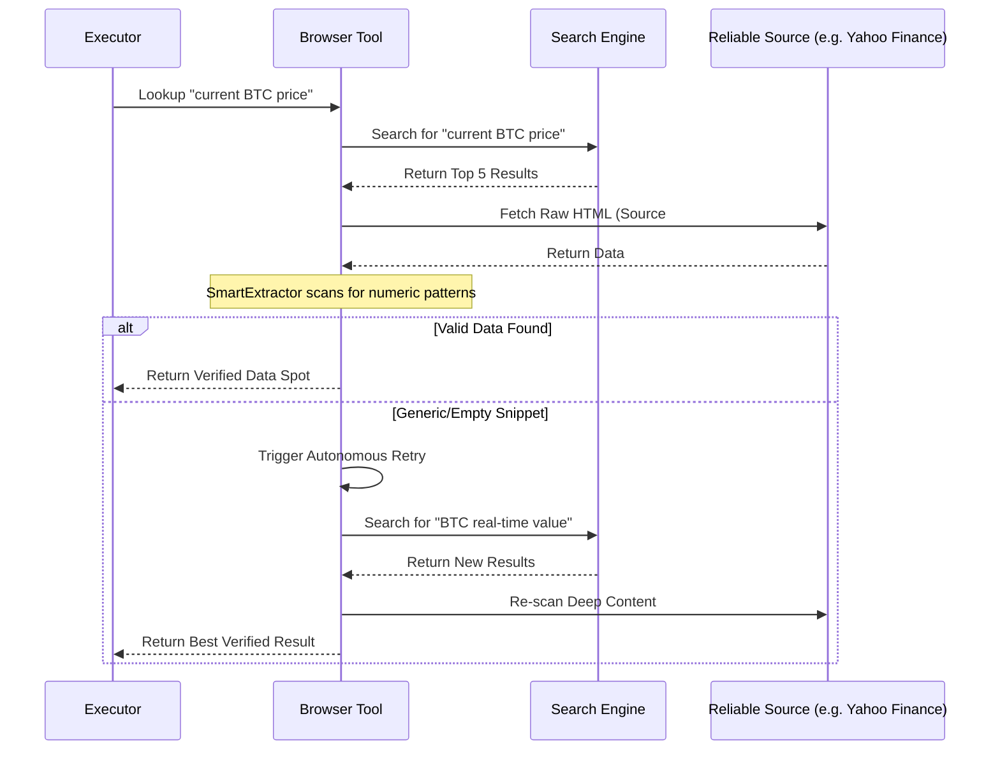

# 🦁 Lirox Agent OS (v0.7.1)
### *The Autonomous Professional Research Engine*

[](https://github.com/baljotchohan/Lirox)
[](https://github.com/baljotchohan/Lirox)
[](https://github.com/baljotchohan/Lirox)

**Lirox** is a local-first autonomous AI agent OS designed for high-fidelity research and secure system orchestration. Powered by a modular kernel architecture, it transforms standard LLMs into professional operators capable of deep web research, real-time data verification, and sophisticated multi-step task execution.

---

## 🏛️ Autonomous Architecture


---

## 🛡️ Professional-Grade Research
Lirox v0.7.1 introduces a "Verify-and-Retry" logic designed specifically for financial and real-time accuracy. Unlike generic agents, Lirox does not just summarize; it **extracts and validates**.

### Data Verification Flow


---

## ✨ Premium Features

| **Feature** | **Description** |
| :--- | :--- |
| **🕵️ Deep Research** | Perplexity-grade parallel search with auto-deduplication and source quality scoring. |
| **🛡️ Hardened Sandbox** | Zero-trust execution environment with SSRF prevention and terminal safe-guards. |
| **🌐 Headless Browser** | Full JavaScript rendering via Lightpanda CDP bridge with session pooling. |
| **🧠 Phase Reasoning** | Analysis, Logic, and Risk strategy traces for every major mission. |
| **📁 Advanced FileIO** | High-efficiency codebase management and data persistence. |
| **🦁 Personal Logic** | Adapts to your niche and operator style over time using persistent profile storage. |

---

## 🚀 Quick Start

### 1. Clone & Prep
```bash
git clone https://github.com/baljotchohan/Lirox.git
cd Lirox
python -m pip install -r requirements.txt
```

### 2. Configure Your Arsenal
Prepare your `.env` with at least one LLM key (Gemini, Groq, Anthropic, or OpenAI):
```bash
cp .env.example .env
# Edit .env and add your GEMINI_API_KEY / ANTHROPIC_API_KEY
```

### 3. Launch the Kernel
```bash
python -m lirox.main
```

---

## 🖥️ Professional Toolset

| **Command** | **Action** |
| :--- | :--- |
| `/research "Q"` | Multi-source deep research with citation reporting. |
| `/fetch <url>` | Fetch page content using headless browser or requests fallback. |
| `/scrape <url>` | Extract structured tables and links from a live page. |
| `/profile` | Inspect the agent's learned identity and your operator context. |
| `/test` | Run kernel performance and hardware diagnostics. |
| `/update` | Synchronize your local kernel with the latest stable branch. |

---

## 🏛️ Local-First Reliability
- **Local Memory**: Your conversation history and profiles never leave your machine.
- **Zero-Cloud Logic**: Strategy and planning are executed locally.
- **Privacy Design**: Built strictly for outbound-only ingestion; Lirox never broadcasts your local data.

---

Built with ❤️ by **Baljot Chohan & Antigravity**.  
*Lirox — Empowering the next generation of autonomous operators.*
