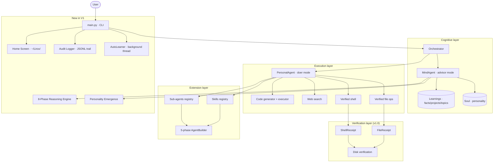

<div align="center">

# 🦁 Lirox

### **A personal AI agent that lives in your terminal — and actually remembers you.**

*Local-first · Terminal-first · Persistent memory · Self-extending · Self-learning*

[](LICENSE)
[](https://python.org)
[](#privacy--local-first)
[](#)
[](CHANGELOG.md)

</div>

---

## What is Lirox?

Lirox is a CLI-first autonomous AI agent that does things every other AI tool fails at:

1. **It remembers you.** Across every session, restart, and reinstall — Lirox builds a structured memory of who you are, what you work on, how you talk, and what you care about. You can even import your existing history from ChatGPT, Claude, or Gemini.
2. **It learns automatically in the background.** A background thread trains every 30 minutes (configurable), silently extracting facts without interrupting your work.
3. **It develops a personality.** Based on your niche, goals, and communication style, Lirox generates unique personality traits that make responses feel like *yours*.
4. **It actually executes.** When you ask it to write a file, it writes the file — and verifies the bytes hit disk before claiming success.
5. **It extends itself.** Tell it "I need a tool that summarizes my git diffs" and it builds a Python skill, validates the contract, and registers it.
6. **It has a Home Screen workspace.** A `~/Lirox/` folder gives you easy access to all your data, memory, and backups from your file manager.

It runs in your terminal, stores everything on your machine, and works fully offline with Ollama if you want.

---

## ⚡ Quick start

```bash
# 1. Clone
git clone https://github.com/baljotchohan/lirox.git
cd lirox

# 2. Install (creates a venv automatically if you want)
python3 -m venv .venv && source .venv/bin/activate
pip install -e ".[full]"

# 3. First run — wizard guides you through setup
lirox
```

The first launch opens a deep onboarding wizard that asks about your work, your current project, your goals, and which LLM you want to use (cloud, local, or both). After ~90 seconds, the agent already knows enough about you to be genuinely helpful from message #1.

---

## What's new in V1 (Production-Ready Rebuild)

### 12 Critical Bugs Fixed at Root Level

| Bug | Area | Fix |
|-----|------|-----|
| **BUG-1** | Directory permissions | `_make_dir_safe()` creates with mode `0o700`, validates write access, provides helpful errors |
| **BUG-2** | Home Screen access | Setup wizard asks to create `~/Lirox/` workspace with file manager integration |
| **BUG-3** | Permission enforcement | `_self_mod_blocked()` called in ALL write paths; audit log records every check |
| **BUG-4** | Auto-learning | `AutoLearner` background thread trains every 30 min + after every N messages |
| **BUG-5** | Sub-agent routing | Regex handles multi-word names, hyphens, spaces; normalizes to `PascalCase` |
| **BUG-6** | Setup file permissions | Write access validated before wizard starts; profile save verified after |
| **BUG-7** | JSON import | Robust `_extract_json_robust()` handles fences, preambles, malformed input |
| **BUG-8** | Skill parameters | `shlex.split()` failures fall back to regex tokenizer; handles `#`, unbalanced quotes |
| **BUG-9** | Thinking timeout | `concurrent.futures` timeout wraps all LLM calls; graceful degradation on timeout |
| **BUG-10** | Windows backup | `_copy_tree()` skips symlinks, handles `\\?\` long paths, shows progress |
| **BUG-11** | Training cursor | Cursor persisted to `learnings.json` via `_set_cursor()` after every train |
| **BUG-12** | Self-mod gate | `is_self_modification()` called before every write; audit logged |

### New Modules

| Module | Purpose |
|--------|---------|
| `lirox/home_screen/integration.py` | `~/Lirox/` workspace creation + platform shortcuts |
| `lirox/autonomy/auto_learner.py` | Background training thread (daemon, configurable) |
| `lirox/audit/logger.py` | Comprehensive JSONL audit trail for all operations |
| `lirox/reasoning/advanced_engine.py` | 8-phase reasoning: UNDERSTAND → VERIFY |
| `lirox/personality/emergence.py` | Personality trait generation from user profile |

### New Commands

| Command | Description |
|---------|-------------|
| `/audit [n]` | View last n audit log entries |
| `/personality` | View current agent personality traits |
| `/personality update` | Regenerate personality from profile |

### New Configuration

```env
# Auto-training
AUTO_TRAIN_ENABLED=true
AUTO_TRAIN_INTERVAL_MINUTES=30
AUTO_TRAIN_AFTER_MESSAGES=10

# Home Screen
HOME_SCREEN_FOLDER=~/Lirox

# Reasoning
THINKING_TIMEOUT=120
ENABLE_TREE_OF_THOUGHT=true

# Audit
AUDIT_ENABLED=true

# Personality
PERSONALITY_ENABLED=true
```

---

## 🧠 How it remembers you

Lirox uses a three-tier memory model:

```
┌─────────────────────────────────────────────────────────────┐
│  LIVE BUFFER       (last ~100 messages, in-memory)         │
│       ↓                                                     │
│  DAILY JSONL LOGS  (every exchange, persisted to disk)     │
│       ↓                                                     │
│  LEARNINGS STORE   (crystallized facts, projects,          │
│                     preferences, topics — survives forever) │
└─────────────────────────────────────────────────────────────┘
```

- The **live buffer** powers same-session context.
- **Daily JSONL** is the source of truth for `/train`.
- The **learnings store** is what makes Lirox feel like *yours* — it accumulates facts about you (`"User uses FastAPI for backends"`, `"Currently shipping Lirox v1.1"`, `"Prefers concise replies"`) and injects them into every response's system prompt.

**You can import existing history from other LLMs.** During setup, Lirox shows you a one-paste prompt to copy into ChatGPT / Claude / Gemini. Paste the JSON they return back into Lirox, and your facts/preferences/projects are merged in. Works with both raw JSON and fenced (```json ... ```) blocks.

---

## 🛠 Architecture



The cognitive layer (Mind / Soul / Learnings) handles personalization. The execution layer (PersonalAgent + tools) handles doing things. The verification layer is the safety net — every side effect is checked before being reported as successful. New in V1: background auto-learning, audit logging, personality emergence, 8-phase reasoning, and Home Screen integration.

---

## 📋 Command reference

### Conversation & memory

| Command | What it does |
|---------|--------------|
| `/help` | Show all commands |
| `/profile` | Show your profile (name, niche, project, goals) |
| `/recall` | Show what Lirox knows about you (facts, projects, topics) |
| `/learnings` | Full dump of the learnings store |
| `/memory` | Memory stats per agent |
| `/history [n]` | Last N session names |
| `/session` | Current session info |
| `/reset` | Clear in-session memory (does NOT touch learnings) |

### Training & import/export

| Command | What it does |
|---------|--------------|
| `/train` | Crystallize recent conversations into permanent learnings (cursor-based — only processes new content) |
| `/import-memory [path]` | Import from ChatGPT JSON / Claude JSON / Gemini Takeout / Lirox export / pasted JSON |
| `/export-memory` | Export profile + learnings as a single JSON file |
| `/backup` | Backup all data to `~/.lirox_backup/` |

### Skills & sub-agents

| Command | What it does |
|---------|--------------|
| `/add-skill <description>` | Build a new skill via the 5-phase builder (think → generate → validate → test → register) |
| `/skills` | List loaded skills |
| `/use-skill <name> [k=v ...]` | Invoke a skill |
| `/add-agent <description>` | Build a new sub-agent the same way |
| `/agents` | List sub-agents |
| `@<name> <query>` · `hey <name>, <q>` · `ask <name> to <q>` | Route a query to a sub-agent |

### Self-improvement

| Command | What it does |
|---------|--------------|
| `/improve` | Audit the Lirox source tree, stage patches |
| `/pending` | List staged patches |
| `/apply` | Show diffs, approve, apply, restart |
| `/self-execute [desc]` | Autonomous code scan or one-off generation |

### Models & permissions

| Command | What it does |
|---------|--------------|
| `/models` | List available LLM providers |
| `/use-model <name>` | Pin a provider for this session (`groq`, `gemini`, `openai`, `anthropic`, `ollama`, `auto`) |
| `/permissions` | Show current permission tiers |
| `/ask-permission <0–5>` | Request a higher tier (file-write, code-exec, self-modify, etc.) |

### System

| Command | What it does |
|---------|--------------|
| `/setup` | Re-run the deep onboarding wizard |
| `/test` | Run diagnostics |
| `/restart` | Restart Lirox in place |
| `/update` | Pull the latest version |
| `/uninstall` | Wipe all Lirox data |
| `/exit` | Quit |
| `/audit [n]` | View last n audit log entries |
| `/personality` | View current personality traits |
| `/personality update` | Regenerate personality from profile |

---

## 🧪 Examples

**Build a skill on the fly:**

```
> /add-skill extract all hashtags from a string

🧠 Phase 1 — Analysing requirements (niche-aware)…
✍️  Phase 2 — Generating skill code…
🔎 Phase 3 — Validating code + contract…  ✓ Code is valid
🧪 Phase 4 — Running auto-generated tests…  ✓ Tests passed (3)
💾 Phase 5 — Registering skill…  ✅ Skill 'extract_hashtags' registered

> /use-skill extract_hashtags input="checkout #lirox and #ai for the win"
['#lirox', '#ai']
```

**Verified file write:**

```
> create a file at ~/Desktop/notes.md with three bullets summarizing my goals

📁 write_file: /Users/baljot/Desktop/notes.md
✅ Wrote 287 bytes to /Users/baljot/Desktop/notes.md (verified on disk)
```

If the disk write fails for any reason — permissions, missing parent directory, blocked path — you get an explicit `❌` with the actual error, never a fake confirmation.

**One-paste memory import:**

```
> /import-memory

📋 Memory Import
1. Copy the prompt below into ChatGPT/Claude/Gemini.
2. Copy their JSON reply back here.
3. Type END on its own line to finish.

[ prompt shown ]

  ```json
  {"facts": ["Uses FastAPI", "Based in NYC"], "projects": [...]}
  ```
  END

✓ Import complete
  • Facts added: 2
  • Projects added: 1
  • Topics added: 4
```

---

## 🔒 Privacy & local-first

- **Your data lives on your machine.** Profile, learnings, soul, sessions — all in `data/` and `profile.json` next to the source.
- **No telemetry.** Lirox does not phone home.
- **Local LLMs are first-class.** Ollama, llama.cpp endpoints, anything OpenAI-compatible. Set up via `/setup` or by editing `.env`:

```env
LOCAL_LLM_ENABLED=true
OLLAMA_ENDPOINT=http://localhost:11434
OLLAMA_MODEL=llama3.1
```

- **Cloud providers are opt-in.** Groq, Gemini, OpenAI, Anthropic, OpenRouter, DeepSeek — pick any combination. API keys live in your local `.env`, never sent anywhere except the provider you're calling.
- **Self-modification is gated.** Lirox cannot overwrite its own source code unless you set `LIROX_ALLOW_SELF_MOD=1`.

---

## 📦 Installation details

### Requirements

- Python **3.9+**
- pip (bundled with Python)
- Optional: [Ollama](https://ollama.com) for fully offline use

### macOS / Linux

```bash
git clone https://github.com/baljotchohan/lirox.git
cd lirox
python3 -m venv .venv && source .venv/bin/activate
python3 -m pip install --upgrade pip
python3 -m pip install -e ".[full]"
lirox
```

### Windows (PowerShell)

```powershell
git clone https://github.com/baljotchohan/lirox.git
cd lirox
py -m venv .venv
.venv\Scripts\Activate.ps1
py -m pip install --upgrade pip
py -m pip install -e ".[full]"
lirox
```

Lirox auto-detects missing dependencies at startup and installs them. If something blocks pip, you can install manually:

```bash
python3 -m pip install -r requirements.txt
```

---

## 🗂 Project structure

```
lirox/
├── agent/              # User profile system
├── agents/             # PersonalAgent + 5-phase AgentBuilder
├── autonomy/           # Self-improver, code generator, code executor, permissions
├── memory/             # MemoryManager, SessionStore, import handler, sync prompt
├── mind/               # Soul, Learnings, Trainer, Skills, SubAgents
├── onboarding/         # Niche profiles + wizard learnings seeding
├── orchestrator/       # MasterOrchestrator (routes user queries)
├── skills/             # Legacy JSON skill executor (kept for back-compat)
├── thinking/           # Chain-of-thought + advanced reasoning engines
├── tools/              # File ops, shell, browser, web search, code executor
├── ui/                 # Display, wizard, permission UI, progress UI
├── utils/              # LLM layer, logging, validation, rate limiting
└── verify/             # Receipts + disk verification (the v1.1 safety layer)
```

---

## 🤝 Contributing

Lirox is built in the open. Contributions, bug reports, and feature ideas are welcome. See [`CONTRIBUTING.md`](CONTRIBUTING.md) for the workflow.

If you find a bug, the most useful thing you can do is open an issue with:
- The exact command/query you ran
- What you expected
- What actually happened
- Output from `/test` if it's a runtime issue

---

## 📜 License

MIT. See [`LICENSE`](LICENSE).

---

<div align="center">

**Terminal-first · Local-first · Persistent**

*Built for people who want their AI to actually know them.*

[Documentation](USE_LIROX.md) · [Commands](COMMANDS.md) · [Advanced](ADVANCED.md) · [Changelog](CHANGELOG.md)

</div>
