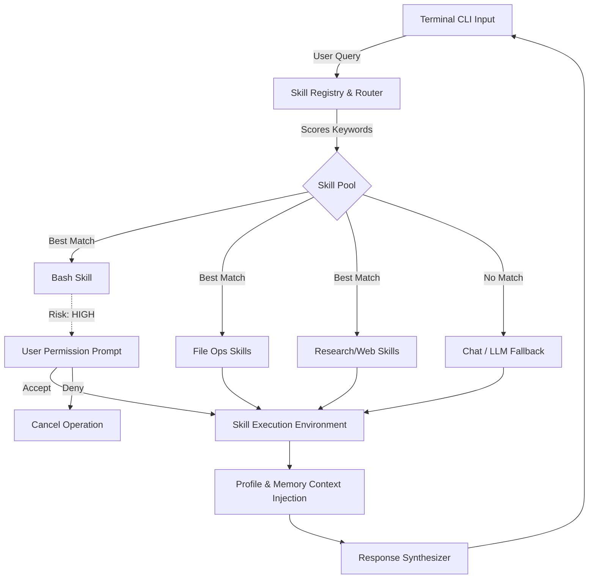

<div align="center">
  <pre>
        /\_/\  
       ( o.o ) 
        > ^ <  
  </pre>
  <h1>LIROX Autonomous OS</h1>
  <p><strong>v1.0 — Skill-Based CLI Autonomous Agent</strong></p>
</div>

Lirox is a powerful, terminal-first autonomous AI agent designed with a highly modular, pluggable **Skill-Based Architecture**. It processes natural language instructions, routes them to specific tool modules (Skills), and executes sophisticated real-world actions ranging from file orchestration and Bash operations to deep multi-source research.

---

## 🌟 Key Features (v1.0)

- **Pluggable Skill Architecture**: Completely decoupled tool execution. Skills self-register and declare their intent and risk profiles. Adding a new behavior is as simple as dropping a new file in the `skills/` folder.
- **Intelligent Routing**: Natural language directly maps to the best tool without needing expensive LLM chains for simple task delegations.
- **Risk & Permission Guardrails**: Explicit clearance limits. High-risk skills (like `bash` execution or file manipulations) require active user confirmation before deployment.
- **Multi-Source Research**: Built-in verification logic fetches, scrapes, ranks, and synthesizes data.
- **Interactive Onboarding**: Fluid console-driven wizard for seamless model integration and profile configuration.
- **Stateful Memory & Learning**: Learns operator preferences over interactions. Tracks active context silently. 

---

## ⚙️ How It Works (The Skill Engine)

Lirox intercepts queries and dynamically scores them against the registered capabilities of its Tool Pool.



---

## 🛠️ The Skill Pool

These core modules are integrated natively into Lirox out of the box:

| Skill | Risk Level | Description |
|---|---|---|
| **Bash** | 🔴 HIGH | Safely execute bash commands within the CLI. Unlocks total environment control. |
| **File Write** | 🔴 HIGH | Generates, structures, and writes raw code to targeted files in the ecosystem. |
| **File Edit** | 🔴 HIGH | Search, replace, and dynamically iterate upon existing file content. |
| **File Read**| 🟢 LOW | Peeks into current or targeted directory structures to scrape project context. |
| **Web Search** | 🟢 LOW | Performs live internet searches to pull the latest headlines and verified information. |
| **Web Fetch** | 🟠 MEDIUM | Employs HTTP fallbacks and headless browsing scraping to extract deep page contents. |
| **Research** | 🟢 LOW | Multi-source deep-dive agent capable of building comprehensive synthesis reports and citations. |
| **Chat** | 🟢 SAFE | Standard fallback operator interaction handling natural conversational logic. |

---

## 🚀 Installation & Setup

1. **Clone the Repository**
   ```bash
   git clone https://github.com/your-username/Lirox.git
   cd Lirox
   ```

2. **Install the CLI Tooling**
   Lirox utilizes `setuptools` build mechanisms.
   ```bash
   pip install -e .
   ```

3. **Initialize the Agent**
   To instantly jump into the onboarding wizard allowing you to choose models, API keys, and configurations, simply run:
   ```bash
   lirox
   ```

---

## 💻 Usage & Commands

Lirox acts as an OS layer directly over your bash terminal. Once inside the active session, you can assign it tasks or run direct commands:

```bash
# Standard Conversational Input
[Lirox] ✦ List out the files in the current directory and open the config.
[Lirox] ✦ Write a Python script that scrapes HackerNews and save it as scraper.py.
[Lirox] ✦ Research Sam Altman's recent investments and summarize them.
```

**Slash Commands:**
Direct terminal commands allow for overriding natural language mappings.

- `/skills` - View all active skills inside the registry and their operating status.
- `/enable <skill>` - Manually switch ON a specialized capability.
- `/disable <skill>` - Manually switch OFF a distinct capability.
- `/research <query>` - Force override into Deep Research mode.
- `/web <url>` - Instantly fetch, scrape, and extract content from a specific URL.
- `/profile` - View your agent's learning context, memory banks, and system configurations.
- `/models` - Peek into the current active LLMs connected to your system.
- `/test` - Run kernel integrity diagnostics to insure internal systems operate nominally.
- `/update` - Synchronize and gracefully update the agent via origin branches.
- `/reset` - Complete factory purge of operator profiles and memory strings.
- `/help` - Open the reference payload for commands.

---

## 🏗️ Expanding Lirox (Building Custom Skills)

Building a custom skill is incredibly straightforward due to the auto-discovery mechanism.

1. Create a `your_custom_skill.py` directly inside `/lirox/skills/`.
2. Subclass `BaseSkill`.
3. Provide your `RiskLevel`, descriptive `keywords`, and the overarching `execute()` logic. 

**Example Template:**
```python
from lirox.skills import BaseSkill, SkillResult, RiskLevel

class MyCustomSkill(BaseSkill):
    @property
    def name(self) -> str:
        return "my_custom"

    @property
    def description(self) -> str:
        return "Does something amazing"

    @property
    def risk_level(self) -> RiskLevel:
        return RiskLevel.SAFE

    @property
    def keywords(self) -> list[str]:
        return ["custom", "amazing", "do work"]

    def execute(self, query: str, context: dict = None) -> SkillResult:
        # Your python logic here
        return SkillResult(
            success=True,
            output="Executed amazingly!",
            skill_name=self.name
        )
```

Lirox will automatically bind this parameter onto the router on the next boot, actively mapping it to conversational triggers.

---

<div align="center">
  <i>Developed to bring structured agent logic safely to standard terminals globally.</i>
</div>
