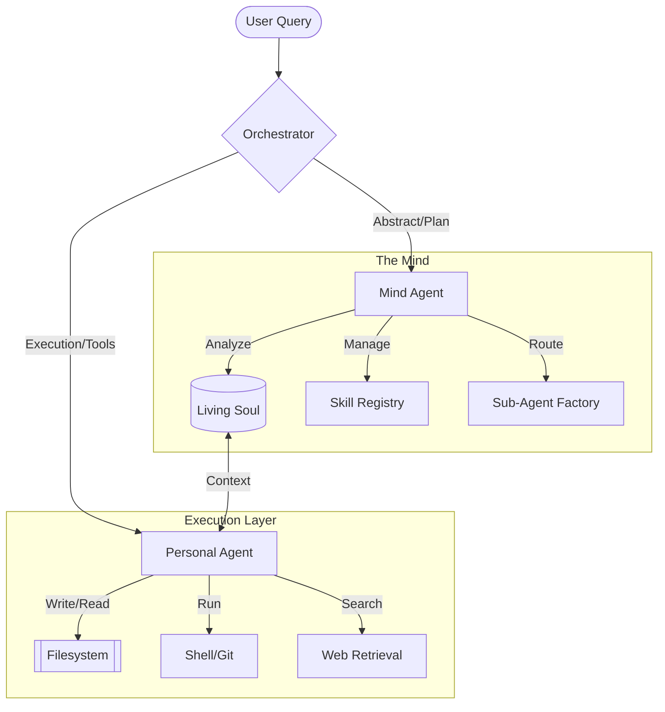

<div align="center">
  
  <br />
  <br />
  
  **Intelligence as an Operating System — Terminal-first. Local-first. Persistent.**
  
  [](LICENSE)
  [](https://python.org)
  [](#local-first)
  [](https://twitter.com/lirox_ai)

  <p align="center">
    <a href="#-core-features">Features</a> •
    <a href="#-quick-start">Quick Start</a> •
    <a href="#-how-it-works">Architecture</a> •
    <a href="#-command-registry">Commands</a> •
    <a href="#-self-improvement">Self-Growth</a>
  </p>
</div>

---

## ✦ What is Lirox?

Lirox is not just another LLM wrapper. It is a **Personal AI Agent Operating System** that lives in your terminal. While generic AI tools forget you the second you close the tab, Lirox builds a **recursive memory model** of your professional identity, projects, and working style.

It doesn't just "chat"—it **executes**. It reads your codebase, manages your filesystem, automates your shell, and researches for you, all while evolving into a digital mirror of your own expertise.

---

## 🚀 Core Features

### 🧠 Recursive Mind Agent
Unlike standard chat buffers, Lirox features a **Mind Agent** that continuously extracts facts, preferences, and project contexts. 
*   **Automatic Learning:** Silently analyzes interactions to update your "Soul" file.
*   **Manual Refinement:** Use `/train` to crystallize messy sessions into permanent knowledge.
*   **Contextual Recall:** Automatically injects relevant past facts into new queries.

### 💻 System Architect (PersonalAgent)
The PersonalAgent handles the "heavy lifting" with **zero truncation** and **full system access**.
*   **Full Filesystem CRUD:** Create, read, update, and delete files with natural language.
*   **Shell Execution:** Run commands, manage git repos, and install dependencies directly.
*   **Web Retrieval:** Fresh knowledge via autonomous web search.
*   **Code Synthesis:** Writes ready-to-use, complete implementations including error handling.

### 🔧 Dynamic Skill & Agent Engine
Extend Lirox by simply describing what you need:
*   **`/add-skill`**: Describe a workflow (e.g., "Summarize every PDF in this folder") and Lirox generates the Python logic.
*   **`/add-agent`**: Create specialized sub-agents (e.g., `@CodeReviewer`, `@Researcher`) with unique personalities and system prompts.

---

## ⚡ Quick Start

### Installation

```bash
# 1. Clone and install
git clone https://github.com/baljotchohan/lirox.git
cd lirox
pip install -e ".[full]"

# 2. Setup your providers (interactively)
lirox --setup

# 3. Launch the OS
lirox
```

### Run Fully Local (Recommended)
Keep your data 100% private using [Ollama](https://ollama.com):

```bash
ollama run llama3
# In your .env:
# LOCAL_LLM_ENABLED=true
# OLLAMA_MODEL=llama3
```

---

## 🎨 Interface Preview

<div align="center">
  
</div>

---

## 🛠 Command Registry

| Command | Action | Description |
| :--- | :--- | :--- |
| `/train` | **Crystallize** | Extract facts from recent history into permanent storage |
| `/improve` | **Self-Audit** | Scan source code for bugs and stage automated patches |
| `/think <q>` | **Deep Reason** | Enable the chain-of-thought engine for complex planning |
| `/learnings`| **Memory** | Peek inside Lirox's permanent mental model of you |
| `/add-skill`| **Extend** | Build a new reusable tool using natural language |
| `@agent` | **Dispatch** | Direct a query to a specialized custom sub-agent |
| `/soul` | **Identity** | View the current stats and nature of your agent's personality |

---

## 📐 How It Works



---

## 🛠 Self-Improvement Workflow

Lirox is designed to fix its own bugs. 

1.  **`/improve`**: Lirox audits its own codebase, searching for circular imports, dead code, or inefficient patterns.
2.  **`/pending`**: View the generated code patches in a unified diff format.
3.  **`/apply`**: Approve the changes. Lirox creates a backup, applies the fix, and restarts itself.

---

## 📂 Configuration

Lirox is provider-agnostic. Configure your `.env` with any combination of:
- **Local:** Ollama, HF Bit-and-Bytes
- **Cloud:** Anthropic (Claude 3.5), Google (Gemini 2.0), Groq (Llama 3), OpenAI (GPT-4), DeepSeek, NVIDIA, OpenRouter.

*Lirox automatically falls back to the next available provider if one fails.*

---

## 🤝 Contributing

We are building a future where everyone has a digital twin that truly understands them.
- **Skills:** Add new tools to `lirox/skills/`.
- **Core:** Help us improve the memory importers or the self-improvement engine.
- **UI:** Join the upcoming Web UI project.

---

<div align="center">
  <p><strong>Terminal-first. Local-first. Persistent.</strong></p>
  <p><em>Built for the developers of tomorrow.</em></p>
</div>
